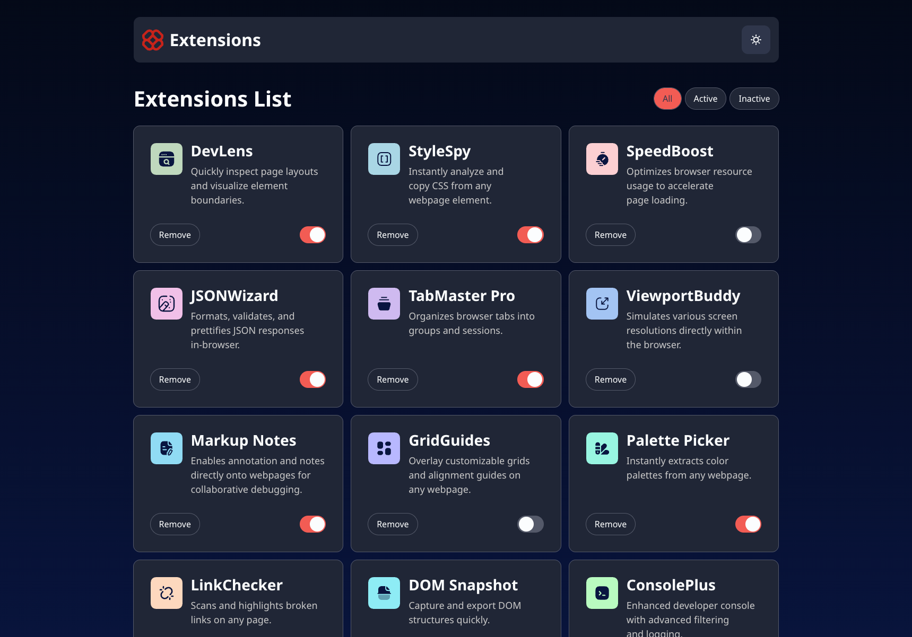
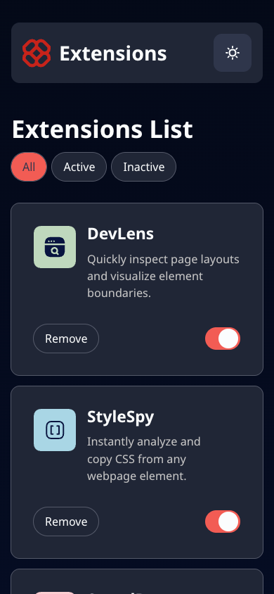
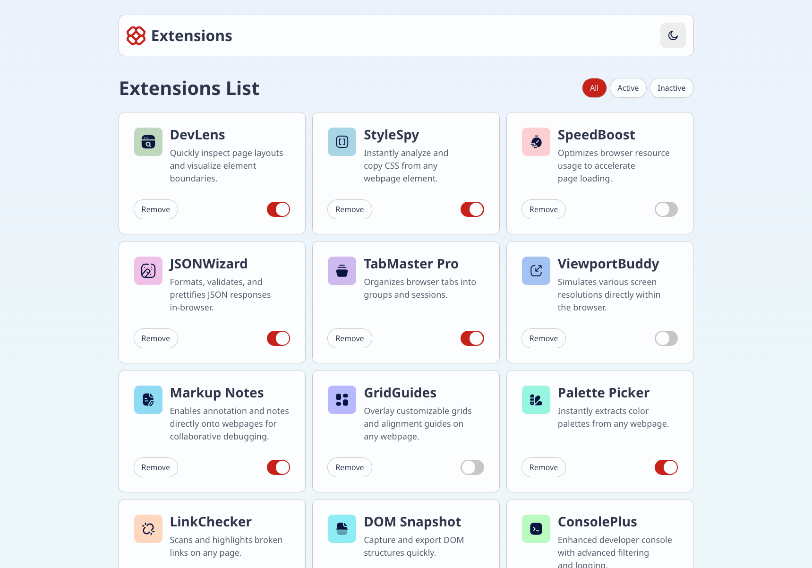
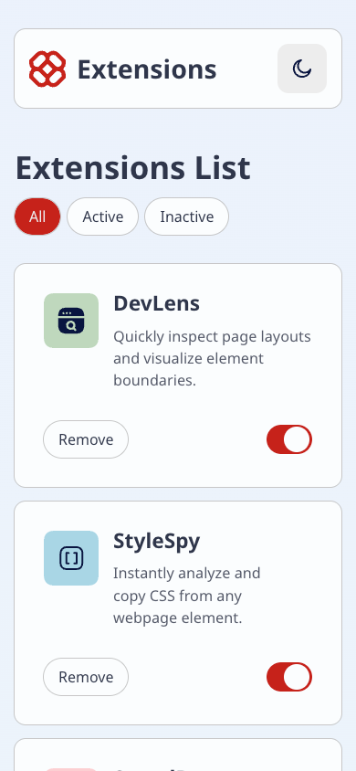

# Frontend Mentor - Browser extensions manager UI solution

This is a solution to the [Browser extensions manager UI challenge on Frontend Mentor](https://www.frontendmentor.io/challenges/browser-extension-manager-ui-yNZnOfsMAp). Frontend Mentor challenges help you improve your coding skills by building realistic projects.

## Table of contents

-   [Overview](#overview)
    -   [The challenge](#the-challenge)
    -   [Screenshot](#screenshot)
    -   [Links](#links)
-   [My process](#my-process)
    -   [What I practiced](#what-i-practiced)
    -   [Built with](#built-with)
-   [Author](#author)

## Overview

### The challenge

Users should be able to:

-   Toggle extensions between active and inactive states
-   Filter active and inactive extensions
-   Remove extensions from the list
-   Select their color theme
-   View the optimal layout for the interface depending on their device's screen size
-   See hover and focus states for all interactive elements on the page

### Screenshot

### Links

-   [You can try it live here](https://darryndotdev.github.io/browser-extensions-manager-ui/)

## My process

### What I practiced

-   Lifted state up so that all state is managed at the app level
-   Leveraged composability by creating UI-specific components with the `children` prop
-   Utilised array methods (`.map()`, `.filter()`) to remove extensions, filter active state and toggle active/inactive states
-   Built a custom, accessible toggle component with keyboard focus support

### Built with

-   [Vite](https://vite.dev/) - Fast and modern frontend tooling for rapid development
-   [React](https://reactjs.org/) - Component-based UI library for building interactive interfaces
-   Semantic HTML5 markup / CSS custom properties / CSS Grid

## Author

-   Website - [darryn.dev](https://darryn.dev/)
